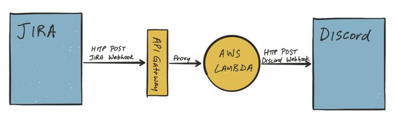

# JIRA Discord AWS Lambda Webhook
A simple AWS lambda function that takes a JIRA webhook payload, creates a Discord compatible webhook payload and executes the appropriate Discord webhook.

### Resources
https://discordapp.com/developers/docs/resources/webhook#execute-webhook
